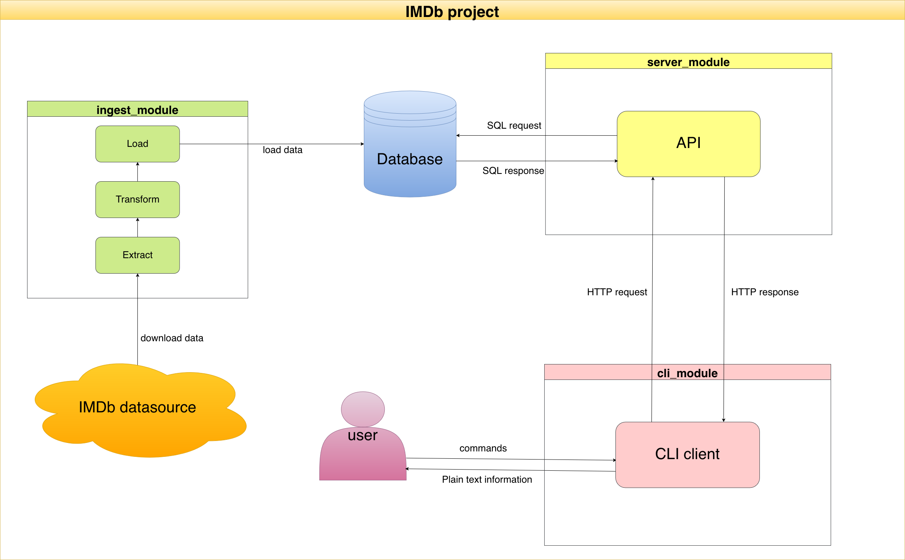

# IMDb ETL + API + CLI

A complete data engineering system that extracts IMDb datasets, processes them through an optimized ETL pipeline, stores results in PostgreSQL, and provides access via both REST API and command-line interfaces. Each module has its own README file with more detailed information.

## Project Overview

This is a full-stack data project organized into three main modules working together:

- **ingest_module** – Extracts IMDb datasets, transforms and cleans the data, and loads it into PostgreSQL using an optimized streaming approach
- **server_module** – FastAPI-based REST API with search capabilities and full-text search indexes  
- **cli_module** – User-friendly command-line interface for querying actors and movies

The system is containerized with Docker and can be fully orchestrated with a single Makefile command. 

### Architecture




### Project Structure

```
.
├── ingest_module/          # ETL pipeline
│   ├── extract/            # Data extraction from IMDb
│   ├── transform/          # Data cleaning and transformation
│   ├── load/               # Database loading
│   └── utils/              # Shared utilities
├── server_module/          # FastAPI REST API
│   ├── src/
│   │   ├── actors/         # Actor routes and logic
│   │   └── movies/         # Movie routes and logic
│   └── core/               # Config, database, logging
├── cli_module/             # Click CLI
│   └── imdb_cli/           # CLI commands and formatters
├── docs/                   # Documentation and diagrams
├── Makefile                # Task automation
├── docker-compose.yml      # Container orchestration
├── README.md               # This file
└── .env                    # Configuration (create from template)
```

## Launch the System

### Prerequisites

- Docker and Docker Compose
- Make
- Python 3.11+ (for CLI usage without Docker)
- PostgreSQL client tools (optional, for direct database access)

The complete system can be started with a single command:

```bash
make up
```

This will:
1. Build all Docker images
2. Start PostgreSQL database
3. Download and process IMDb datasets (actors and movies)
4. Create full-text search indexes for optimal performance
5. Start the FastAPI server

Once complete, the next step is to set up the CLI (example with uv more information bellow or in cli_module `README`):

```bash
# Install uv
brew install uv

# Change to cli module
cd ./cli_module/

# Create virtual environment, sync dependencies and install it as an editable package
# (uv sync creates .venv automatically if it doesn't exist)
uv sync
```

## Makefile Commands

| Command | Description |
|---------|-------------|
| `make help` | Show all available commands |
| `make up` | Start PostgreSQL → Ingest data → Create indexes → Start API |
| `make down` | Stop all services |
| `make status` | Show running containers |
| `make clean` | Remove all containers and volumes |
| `make reload` | Clean and restart everything |
| `make test-api` | Test if API is responding |
| `make db-index` | Create full-text search indexes |
| `make db-clean` | Delete all data from database tables |

## Module Documentation

Each module has detailed documentation:

### [ingest_module](ingest_module/README.md)
Handles data extraction from IMDb, transformation, and loading into PostgreSQL.

**Key Features:**
- Streams IMDb data directly from the web
- ETag-based change detection (only downloads when files change)
- Chunk-based processing for memory efficiency
- PostgreSQL COPY command for 10-50x faster inserts
- Processes millions of rows efficiently

**Supported Datasets:**
- Actors (`name.basics.tsv.gz`) → actors table
- Movies (`title.basics.tsv.gz`) → movies table

### [server_module](server_module/README.md)
FastAPI-based REST API with full-text search and movie/actor endpoints.

**Key Features:**
- Search actors by name
- Search movies by title or genres
- Full-text search with GIN indexes
- Async database queries
- Automatic OpenAPI documentation

**Main Endpoints:**
- `GET /actors/search?name=<query>` - Search actors
- `GET /movies/search?title=<query>` - Search movies
- `GET /health` - API health check

### [cli_module](cli_module/README.md)
Command-line interface for querying the API from the terminal.

**Key Features:**
- Simple actor and movie search
- Configurable result limits
- Beautiful formatted output
- Can work with local or remote API

**Usage:**
```bash
imdb actor "Tom Hanks" --limit 5
imdb movie "Inception" --limit 3
```

## Configuration

Create a `.env` file in the project root with your settings:

```env
# Project
PROJECT_NAME=imdb-project

# Database
POSTGRES_DB=imdb
POSTGRES_USER=imdb_user
POSTGRES_PASSWORD=imdb_pass
DB_CONTAINER_NAME=imdb-db
DB_PORTS=5432:5432

# API
API_URL=http://localhost:8000
API_CONTAINER_NAME=imdb-api
API_EXPOSED_PORTS=8000:8000

# Ingest
INGEST_CONTAINER_NAME=imdb-ingest

# Connection strings. Change "db" for "localhost" for local running
DATABASE_URL=postgresql://imdb_user:imdb_pass@db:5432/imdb 
API_DATABASE_URL=postgresql+asyncpg://imdb_user:imdb_pass@db:5432/imdb
```

## Architecture Details

### Data Flow

1. **Extract**: IMDb datasets are streamed from `datasets.imdbws.com`
2. **Transform**: Data is cleaned, validated, and columns are renamed to match database schema
3. **Load**: Optimized bulk insertion into PostgreSQL using COPY command
4. **Index**: Full-text search indexes created for fast queries
5. **Serve**: API and CLI provide access to the data

### Database Schema

#### actors table
- `nconst` (TEXT, PK) - IMDb person ID
- `primary_name` (TEXT) - Actor/director name
- `birth_year` (SMALLINT) - Birth year
- `death_year` (SMALLINT) - Death year (nullable)
- `primary_profession` (TEXT) - Professions
- `search_vector` (tsvector) - Full-text search index

#### movies table
- `tconst` (TEXT, PK) - IMDb title ID
- `primary_title` (TEXT) - Movie title
- `original_title` (TEXT) - Original language title
- `genres` (TEXT) - Comma-separated genres
- `search_vector` (tsvector) - Full-text search index

## Troubleshooting

### Database Connection Issues
- Check PostgreSQL is running: `psql -U imdb_user -d imdb`
- Verify `.env` credentials match your PostgreSQL setup
- For Docker: `docker logs imdb-db`

### API Not Responding
- Check if containers are running: `make status`
- Test API: `make test-api`
- View logs: `docker logs imdb-api`

### Ingestion Failed
- Check data directory permissions
- Verify internet connection (needs to download from IMDb)
- View logs: `docker logs imdb-ingest`
- Execute `make clean` and start again

### Search Not Working
- Ensure indexes were created: `make db-index`
- Check search_vector columns exist: `psql -d imdb -c "\\d actors"`

## Performance Benchmarks

- **ETL process**: ~50 seconds (depending on internet speed)
- **Creation of columns and search indexes**: ~40 seconds
- **API Response Time**: <100ms for most queries with GIN indexes
- **Total System Setup**: ~1,36 minutes from start to fully operational

## Technology Stack

| Component | Technology |
|-----------|-----------|
| ETL Pipeline | Python, Pandas, SQLAlchemy |
| Database | PostgreSQL 18, GIN Indexes |
| API | FastAPI, AsyncPG |
| CLI | Python Click, Requests |
| Orchestration | Docker, Docker Compose |
| Build/Tasks | Make |

## Module-Specific Documentation

Each module has its own detailed README:
- [ingest_module/README.md](ingest_module/README.md) - ETL pipeline documentation
- [server_module/README.md](server_module/README.md) - API server documentation
- [cli_module/README.md](cli_module/README.md) - CLI tool documentation
