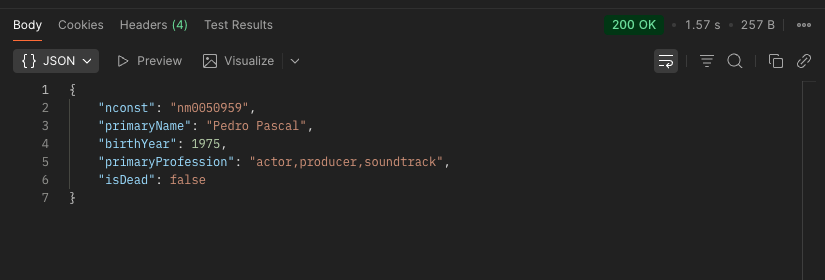
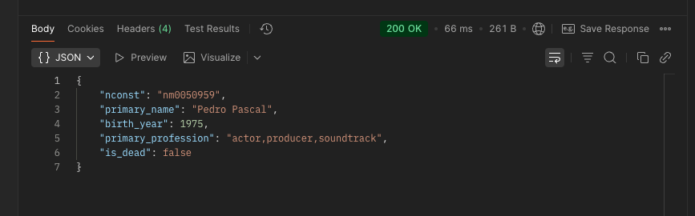

# Server Module

A FastAPI-based REST API server for the IMDb project that provides search capabilities for movies and actors with full-text search support.

## Features

- **RESTful API endpoints** - Search and retrieve actors and movies
- **Full-text search** - Optimized searching with PostgreSQL GIN indexes on columns with tsvector data
- **Async database queries** - Non-blocking database operations with AsyncPG
- **Automatic documentation** - Interactive OpenAPI (Swagger) docs at `/docs`
- **Request validation** - Pydantic models for input validation
- **Error handling** - Comprehensive error responses and logging
- **Health checks** - `/health` endpoint for monitoring

## Project Structure

```
server_module/
├── main.py                 # FastAPI app entry point
├── core/
│   ├── __init__.py
│   ├── config.py           # Configuration management
│   ├── database.py         # Database connection and setup
│   ├── logger.py           # Logging configuration
├── src/
│   ├── __init__.py
│   ├── actors/
│   │   ├── __init__.py
│   │   ├── models.py       # SQLAlchemy models
│   │   ├── schemas.py      # Pydantic validation schemas
│   │   ├── repository.py   # Database queries
│   │   ├── service.py      # Business logic
│   │   ├── routes.py       # API endpoints
│   └── movies/
│       ├── __init__.py
│       ├── models.py       # SQLAlchemy models
│       ├── schemas.py      # Pydantic validation schemas
│       ├── repository.py   # Database queries
│       ├── service.py      # Business logic
│       └── routes.py       # API endpoints
├── tests/
│   ├── __init__.py
│   ├── test_actors.py      # Actor repository unit tests
│   └── test_movies.py      # Movie repository unit tests
├── pyproject.toml          # Dependencies and metadata
├── Dockerfile              # Container configuration
└──README.md               # This file
```

## Architecture

### Layered Structure

The server uses a clean layered architecture:

1. **Routes Layer** (`routes.py`) - HTTP endpoint definitions
2. **Service Layer** (`service.py`) - Business logic
3. **Repository Layer** (`repository.py`) - Database queries
4. **Models Layer** (`models.py`) - SQLAlchemy ORM models
5. **Schemas Layer** (`schemas.py`) - Request/response validation

### Database Connection

- Async SQLAlchemy with AsyncPG for non-blocking database operations
- Connection pooling managed by SQLAlchemy
- Single database session per request (FastAPI dependency injection)

### Full-Text Search

For the search, in an initial instance we chose to query directly on the column using `LIKE` queries, but the response times were quite high (around 1.5 seconds). Therefore, after some investigation, we decided to add a column after the ETL process that transforms the values of `primary_title` into a `tsvector`, and additionally add `GIN indexes`. This resulted in a considerable improvement in response time, reducing it to under 100 ms, with further improvements after making recurrent requests thanks to the indexes.

#### Before optimization



#### After optimization



## Installation

### Prerequisites (for local development)

- Python 3.11 or higher
- PostgreSQL database running with Docker (see main `README.md` for more info)
- Environment variables configured (see Configuration section)

### Local Setup with uv

uv is a fast, modern Python package manager.

#### Step 1: Install uv

```bash
# macOS/Linux
curl -LsSf https://astral.sh/uv/install.sh | sh

# Or via Homebrew (macOS)
brew install uv
```

Verify: `uv --version`

#### Step 2: Create virtual environment and sync dependencies 

```bash
cd /path/to/server_module
uv sync

# Activate virtual environment
source ./.venv/bin/activate
```

#### Step 3: Launch database

```bash
docker-compose up -db -d
```

#### Step 4: Run the Server

```bash
uvicorn main:app --reload
```

The API will be available at `http://127.0.0.1:8000/`

## Interactive Documentation

Visit `http://127.0.0.1:8000/docs` for Swagger UI or `http://127.0.0.1:8000/redoc` for ReDoc

## API Endpoints

### Health Check
- `GET /health` - Check if API is running

### Actor Search
- `GET /actors/search?name=<query>` - Search actors by name
  - **Query Parameters**: 
    - `name` (string, required) - Actor name to search for
  - **Example**: `GET /actors/search?name=Tom Hanks`
  - **Response**: List of matching actors with details

### Movie Search
- `GET /movies/search?title=<query>` - Search movies by title
  - **Query Parameters**:
    - `title` (string, required) - Movie title to search for
  - **Example**: `GET /movies/search?title=Inception`
  - **Response**: List of matching movies with genres

## Dependencies

- `fastapi>=0.109.0` - Modern web framework
- `uvicorn>=0.27.0` - ASGI server
- `sqlalchemy>=2.0.0` - Database ORM
- `asyncpg>=0.29.0` - Async PostgreSQL driver
- `pydantic>=2.0.0` - Data validation
- `python-dotenv>=1.0.0` - Environment variables
- `psycopg2-binary>=2.9.0` - PostgreSQL adapter
- `pytest>=9.0.2` - Testing framework

## Testing

Unit tests are provided in the `tests/` directory:

### Run Tests

```bash
# Run all tests
pytest

# Run specific test file
pytest tests/test_actors.py
pytest tests/test_movies.py
```

### Test Files

- `tests/test_actors.py` - Actor repository unit tests
  - `TestActorRepository.test_get_by_name_returns_actors` - Tests successful actor search
  - `TestActorRepository.test_get_by_name_not_found_raises_404` - Tests 404 error handling

- `tests/test_movies.py` - Movie repository unit tests
  - `TestMovieRepository.test_get_by_title_returns_movies` - Tests successful movie search
  - `TestMovieRepository.test_get_by_title_not_found_raises_404` - Tests 404 error handling

## Performance Notes

- **Search Response Time**: <100ms for typical queries with GIN indexes
- **Connection Pooling**: Automatic connection management
- **Async Processing**: Non-blocking I/O for maximum concurrency
